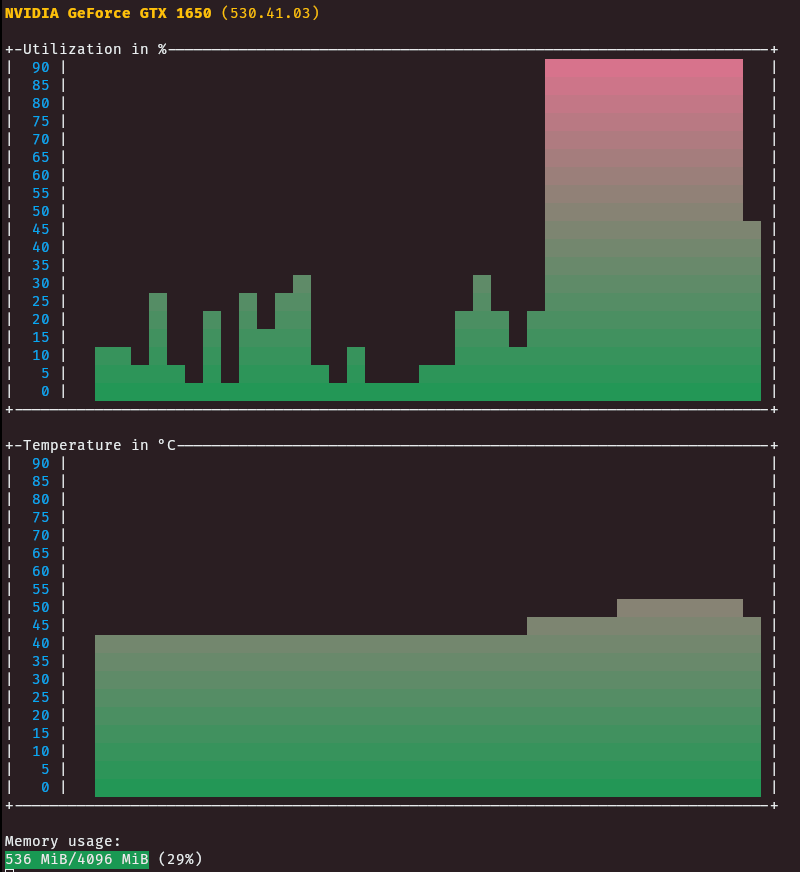

A wrapper for the `nvidia-smi` command. It displays the output in a more coloful and intuitive way. And it is refreshing, and not static like the smi command. Also I tryed to do this with as least 3rd party crates as possible. It is inspired by the graph of my tracker program.



By me for fun in rust.

Licensed under the EUPL.

Copyright (c) 2023 Lovis Rentsch. All Rights Reserved.

## Install

```
git clone https://github.com/BaerLKR/nvidia.git && cd nvidia && cargo build --release && sudo mv target/release/nvidia /bin && cd .. && rm -rf nvidia/ && echo "Done <3"
```
